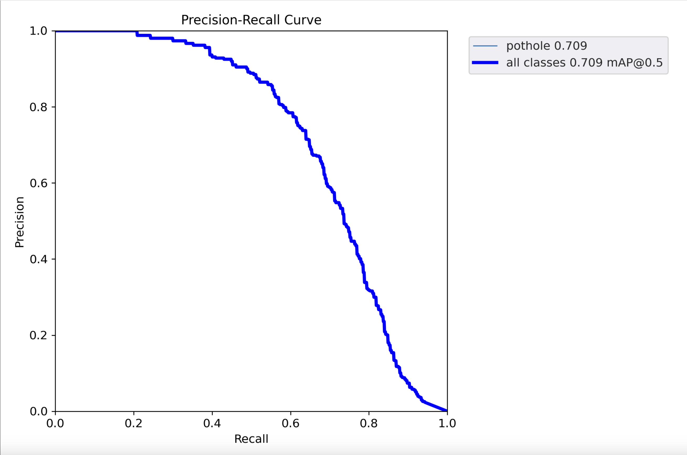

# Object Detection_Pothole

목차
1. [Dataset 구하기](#1-dataset-구하기)
2. [실습 (colab)](#2-실습-colab) </br>
2-1. [모델 다운로드](#2-1-모델-다운로드) </br>
2-2. [데이터셋 다룬로드](#2-2-데이터셋-다운로드)</br>
2-3. [학습 (Traning)](#2-3-학습traning) </br>
2-4. [검증 (Validation)](#2-4-검증validation)</br>
2-5. [추론 (Inference)](#2-5-추론inference)</br>
2-6. [모델 내보내기](#2-6-모델-내보내기)</br>


## 1. Dataset 구하기

[🔗 roboflow ](https://public.roboflow.com/object-detection/pothole/1)


## 2. 실습 (colab)

### 2-1. 모델 다운로드
```python
%cd /content
!git clone https://github.com/ultralytics/yolov5
%cd yolov5
%pip install -qr requirements.txt

import torch
from IPython.display import Image, clear_output
```

### 2-2. 데이터셋 다운로드
```python
%mkdir /content/yolov5/pothole
%cd /content/yolov5/pothole
!curl -L "https://public.roboflow.com/ds/GuOxN66Nsn?key=Zo4hRsX9IS" > roboflow.zip; unzip roboflow.zip; rm roboflow.zip
```

```python
from glob import glob

train_img_list = glob('/content/yolov5/pothole/train/images/*.jpg')
test_img_list = glob('/content/yolov5/pothole/test/images/*.jpg')
valid_img_list = glob('/content/yolov5/pothole/valid/images/*.jpg')

print(len(train_img_list), len(test_img_list), len(valid_img_list))
```


```python
import yaml

with open('/content/yolov5/pothole/train.txt', 'w') as f:
  f.write('\n'.join(train_img_list)+'\n')

with open('/content/yolov5/pothole/test.txt', 'w') as f:
  f.write('\n'.join(test_img_list)+'\n')

with open('/content/yolov5/pothole/valid.txt', 'w') as f:
  f.write('\n'.join(valid_img_list)+'\n')
```

```python
from IPython.core.magic import register_line_cell_magic

@register_line_cell_magic
def writetemplate(line, cell):
  with open(line, 'w') as f:
    f.write(cell.format(**globals()))
```

```python
%%writetemplate /content/yolov5/pothole/data.yaml

train: ./pothole/train/images
test: ./pothole/test/images
val: ./pothole/valid/images

nc: 1
names: ['pothole']
```

```python
import yaml

with open("/content/yolov5/pothole/data.yaml", 'r') as stream:
  num_classes = str(yaml.safe_load(stream)['nc'])

%cat /content/yolov5/models/yolov5s.yaml
```
pothole dataset에 class는 pothole 1개 이므로 nc를 수정한다.
```python
%%writetemplate /content/yolov5/models/custom_yolov5s.yaml

# Parameters
nc: {num_classes} # number of classes
depth_multiple: 0.33 # model depth multiple
width_multiple: 0.50 # layer channel multiple
anchors:
  - [10, 13, 16, 30, 33, 23] # P3/8
  - [30, 61, 62, 45, 59, 119] # P4/16
  - [116, 90, 156, 198, 373, 326] # P5/32

# YOLOv5 v6.0 backbone
backbone:
  # [from, number, module, args]
  [
    [-1, 1, Conv, [64, 6, 2, 2]], # 0-P1/2
    [-1, 1, Conv, [128, 3, 2]], # 1-P2/4
    [-1, 3, C3, [128]],
    [-1, 1, Conv, [256, 3, 2]], # 3-P3/8
    [-1, 6, C3, [256]],
    [-1, 1, Conv, [512, 3, 2]], # 5-P4/16
    [-1, 9, C3, [512]],
    [-1, 1, Conv, [1024, 3, 2]], # 7-P5/32
    [-1, 3, C3, [1024]],
    [-1, 1, SPPF, [1024, 5]], # 9
  ]

# YOLOv5 v6.0 head
head: [
    [-1, 1, Conv, [512, 1, 1]],
    [-1, 1, nn.Upsample, [None, 2, "nearest"]],
    [[-1, 6], 1, Concat, [1]], # cat backbone P4
    [-1, 3, C3, [512, False]], # 13

    [-1, 1, Conv, [256, 1, 1]],
    [-1, 1, nn.Upsample, [None, 2, "nearest"]],
    [[-1, 4], 1, Concat, [1]], # cat backbone P3
    [-1, 3, C3, [256, False]], # 17 (P3/8-small)

    [-1, 1, Conv, [256, 3, 2]],
    [[-1, 14], 1, Concat, [1]], # cat head P4
    [-1, 3, C3, [512, False]], # 20 (P4/16-medium)

    [-1, 1, Conv, [512, 3, 2]],
    [[-1, 10], 1, Concat, [1]], # cat head P5
    [-1, 3, C3, [1024, False]], # 23 (P5/32-large)

    [[17, 20, 23], 1, Detect, [nc, anchors]], # Detect(P3, P4, P5)
  ]
```

### 2-3. 학습(Traning)
* `img`: 입력 이미지 크기 정의
* `batch`: 배치 크기 결정
* `epochs`: 학습 기간 개수 정의
* `data`: yaml 파일 경로
* `cfg`: 모델 구성 지정
* `weights`: 가중치에 대한 경로 지정
* `name`: 결과 이름
* `nosave`: 최종 체크포인트만 저장
* `cache`: 빠른 학습을 위한 이미지 캐시
```python
%%time
%cd /content/yolov5/
!python train.py --img 640 --batch 32 --epochs 100 --dat ./pothole/data.yaml --cfg ./models/custom_yolov5s.yaml --weights '' --name pothole_results --cache
```
<details>
	<summary> 위 코드 실행 결과</summary>

</details>


```python
%load_ext tensorboard
%tensorboard --logdir runs
```
위 명령어 실행시 훈련 모델의 평가지표 그래프를 확인할 수 있다.

<details>
	<summary> 평과지표 그래프</summary>




</details>


```python
!ls /content/yolov5/runs/train/pothole_results/
```
<details>
	<summary> 위 코드 실행 결과</summary>

</details>

```python
Image(filename='/content/yolov5/runs/train/pothole_results/train_batch0.jpg')
```
<details>
	<summary> 위 코드 실행 결과</summary>

</details>


```python
Image(filename='/content/yolov5/runs/train/pothole_results/val_batch0_labels.jpg')
```
<details>
	<summary> 위 코드 실행 결과</summary>

</details>

### 2-4. 검증(Validation)

```python
!python val.py --weights runs/train/pothole_results/weights/best.pt --data ./pothole/data.yaml --img 640 --iou 0.65 --half
```
<details>
	<summary> 위 코드 실행 결과</summary>

```bash
val: data=./pothole/data.yaml, weights=['runs/train/pothole_results/weights/best.pt'], batch_size=32, imgsz=640, conf_thres=0.001, iou_thres=0.65, max_det=300, task=val, device=, workers=8, single_cls=False, augment=False, verbose=False, save_txt=False, save_hybrid=False, save_conf=False, save_json=False, project=runs/val, name=exp, exist_ok=False, half=True, dnn=False
YOLOv5 🚀 v7.0-296-gae4ef3b2 Python-3.10.12 torch-2.2.1+cu121 CUDA:0 (Tesla T4, 15102MiB)

Fusing layers... 
custom_YOLOv5s summary: 157 layers, 7012822 parameters, 0 gradients, 15.8 GFLOPs
val: Scanning /content/yolov5/pothole/valid/labels.cache... 133 images, 0 backgrounds, 0 corrupt: 100% 133/133 [00:00<?, ?it/s]
                 Class     Images  Instances          P          R      mAP50   mAP50-95: 100% 5/5 [00:07<00:00,  1.55s/it]
                   all        133        330      0.738      0.621      0.702      0.366
Speed: 0.3ms pre-process, 27.8ms inference, 15.7ms NMS per image at shape (32, 3, 640, 640)
Results saved to runs/val/exp
```

</details>


```python
!python val.py --weights runs/train/pothole_results/weights/best.pt --data ./pothole/data.yaml --img 640 --task test
```

<details>
	<summary> 위 코드 실행 결과</summary>

```bash
val: data=./pothole/data.yaml, weights=['runs/train/pothole_results/weights/best.pt'], batch_size=32, imgsz=640, conf_thres=0.001, iou_thres=0.6, max_det=300, task=test, device=, workers=8, single_cls=False, augment=False, verbose=False, save_txt=False, save_hybrid=False, save_conf=False, save_json=False, project=runs/val, name=exp, exist_ok=False, half=False, dnn=False
YOLOv5 🚀 v7.0-296-gae4ef3b2 Python-3.10.12 torch-2.2.1+cu121 CUDA:0 (Tesla T4, 15102MiB)

Fusing layers... 
custom_YOLOv5s summary: 157 layers, 7012822 parameters, 0 gradients, 15.8 GFLOPs
test: Scanning /content/yolov5/pothole/test/labels... 67 images, 0 backgrounds, 0 corrupt: 100% 67/67 [00:00<00:00, 1198.77it/s]
test: New cache created: /content/yolov5/pothole/test/labels.cache
                 Class     Images  Instances          P          R      mAP50   mAP50-95:   0% 0/3 [00:00<?, ?it/s]WARNING ⚠️ NMS time limit 2.100s exceeded
                 Class     Images  Instances          P          R      mAP50   mAP50-95: 100% 3/3 [00:05<00:00,  1.75s/it]
                   all         67        154      0.695      0.487       0.51      0.284
Speed: 0.3ms pre-process, 13.9ms inference, 33.9ms NMS per image at shape (32, 3, 640, 640)
Results saved to runs/val/exp2
```

</details>


### 2-5. 추론(Inference)
```python
!python detect.py --weights runs/train/pothole_results/weights/best.pt --img 640 --conf 0.4 --source ./pothole/test/images
```

<details>
	<summary> 위 코드 실행 결과</summary>

```bash
detect: weights=['runs/train/pothole_results/weights/best.pt'], source=./pothole/test/images, data=data/coco128.yaml, imgsz=[640, 640], conf_thres=0.4, iou_thres=0.45, max_det=1000, device=, view_img=False, save_txt=False, save_csv=False, save_conf=False, save_crop=False, nosave=False, classes=None, agnostic_nms=False, augment=False, visualize=False, update=False, project=runs/detect, name=exp, exist_ok=False, line_thickness=3, hide_labels=False, hide_conf=False, half=False, dnn=False, vid_stride=1
YOLOv5 🚀 v7.0-296-gae4ef3b2 Python-3.10.12 torch-2.2.1+cu121 CUDA:0 (Tesla T4, 15102MiB)

Fusing layers... 
custom_YOLOv5s summary: 157 layers, 7012822 parameters, 0 gradients, 15.8 GFLOPs
image 1/67 /content/yolov5/pothole/test/images/img-105_jpg.rf.3fe9dff3d1631e79ecb480ff403bcb86.jpg: 640x640 1 pothole, 11.5ms
image 2/67 /content/yolov5/pothole/test/images/img-107_jpg.rf.2e40485785f6e5e2efec404301b235c2.jpg: 640x640 1 pothole, 11.6ms
image 3/67 /content/yolov5/pothole/test/images/img-146_jpg.rf.61be25b3053a51f622a244980545df2b.jpg: 640x640 1 pothole, 11.5ms
image 4/67 /content/yolov5/pothole/test/images/img-161_jpg.rf.211541e7178a4a93ec0680f26b905427.jpg: 640x640 1 pothole, 11.5ms
image 5/67 /content/yolov5/pothole/test/images/img-168_jpg.rf.af3590e07b06b43e91fa53990ff94af3.jpg: 640x640 2 potholes, 11.5ms
image 6/67 /content/yolov5/pothole/test/images/img-179_jpg.rf.8632eb0d9b75fefe144829e67b75015a.jpg: 640x640 3 potholes, 11.5ms
image 7/67 /content/yolov5/pothole/test/images/img-195_jpg.rf.f77a8f4d432a9a89235168ff8e09a650.jpg: 640x640 3 potholes, 11.5ms
image 8/67 /content/yolov5/pothole/test/images/img-196_jpg.rf.c1e105382a0bb8d329959cea45173cdf.jpg: 640x640 3 potholes, 11.6ms
image 9/67 /content/yolov5/pothole/test/images/img-217_jpg.rf.20e267cdb167c43140e67ec9f5328040.jpg: 640x640 1 pothole, 11.6ms
image 10/67 /content/yolov5/pothole/test/images/img-238_jpg.rf.f146df7999e374dbeaba65f92c518159.jpg: 640x640 1 pothole, 11.5ms
image 11/67 /content/yolov5/pothole/test/images/img-23_jpg.rf.e6aa0daf83e72ccbf1ea10eb6a6ab3bd.jpg: 640x640 4 potholes, 11.5ms
image 12/67 /content/yolov5/pothole/test/images/img-245_jpg.rf.1c9b49a366bda1cf64dbfac2a946cd38.jpg: 640x640 2 potholes, 11.6ms
image 13/67 /content/yolov5/pothole/test/images/img-264_jpg.rf.a98f3f39b1afdea9ce3155bbe107c6c1.jpg: 640x640 (no detections), 11.6ms
image 14/67 /content/yolov5/pothole/test/images/img-269_jpg.rf.f51d9eb8d02a34ac01d4a486cbfbdd4f.jpg: 640x640 1 pothole, 11.6ms
image 15/67 /content/yolov5/pothole/test/images/img-276_jpg.rf.acc167b63d79ab3b99fd64b4109f86d4.jpg: 640x640 1 pothole, 11.7ms
image 16/67 /content/yolov5/pothole/test/images/img-282_jpg.rf.a0ac2a228cf0edb961017e538356b5af.jpg: 640x640 2 potholes, 11.7ms
image 17/67 /content/yolov5/pothole/test/images/img-294_jpg.rf.a16953e9091e3eecfc338ed3044ef294.jpg: 384x640 3 potholes, 63.2ms
image 18/67 /content/yolov5/pothole/test/images/img-300_jpg.rf.6b7b035dff1cda092ce3dc22be8d0135.jpg: 640x640 2 potholes, 11.7ms
image 19/67 /content/yolov5/pothole/test/images/img-307_jpg.rf.65a7065124972969c3efbbca04122668.jpg: 352x640 1 pothole, 55.8ms
image 20/67 /content/yolov5/pothole/test/images/img-308_jpg.rf.454dbf8eb0253ddef84789d3e67290c5.jpg: 480x640 1 pothole, 58.4ms
image 21/67 /content/yolov5/pothole/test/images/img-334_jpg.rf.967014f8076ad78a0828aa4cb9014da2.jpg: 384x640 3 potholes, 9.7ms
image 22/67 /content/yolov5/pothole/test/images/img-336_jpg.rf.eeafb6921ceff278aa8e24afe9f78f8a.jpg: 640x480 2 potholes, 61.4ms
image 23/67 /content/yolov5/pothole/test/images/img-337_jpg.rf.aee9516f4db8d93d1fcf7071196974f9.jpg: 416x640 2 potholes, 55.4ms
image 24/67 /content/yolov5/pothole/test/images/img-343_jpg.rf.64b8e5ed7aa9153427c52de5812b3ab2.jpg: 384x640 2 potholes, 7.6ms
image 25/67 /content/yolov5/pothole/test/images/img-344_jpg.rf.dd4eebb8836b8efe2a2cce77d61349b7.jpg: 448x640 3 potholes, 51.7ms
image 26/67 /content/yolov5/pothole/test/images/img-350_jpg.rf.643e7315948dd95c0787f6dc5c938ff3.jpg: 448x640 3 potholes, 8.6ms
image 27/67 /content/yolov5/pothole/test/images/img-362_jpg.rf.6363ec1a7603671afb1887d9f16c03e7.jpg: 416x640 1 pothole, 8.5ms
image 28/67 /content/yolov5/pothole/test/images/img-364_jpg.rf.e385283baa4507e9b6a79c9e92c4b453.jpg: 448x640 1 pothole, 8.6ms
image 29/67 /content/yolov5/pothole/test/images/img-36_jpg.rf.47f0fb502327ec69d5a041581727a149.jpg: 640x640 1 pothole, 11.6ms
image 30/67 /content/yolov5/pothole/test/images/img-370_jpg.rf.05c61289bcb823fd9234f20448a9ff3a.jpg: 288x640 1 pothole, 52.4ms
image 31/67 /content/yolov5/pothole/test/images/img-371_jpg.rf.a893e0bdc6fda0ba1b2a7f07d56cec23.jpg: 320x640 1 pothole, 54.8ms
image 32/67 /content/yolov5/pothole/test/images/img-390_jpg.rf.3eeb4356ab769c112edf7f482110f8ee.jpg: 640x480 1 pothole, 8.7ms
image 33/67 /content/yolov5/pothole/test/images/img-394_jpg.rf.2182e193f33ed5bcce45df7df27032f7.jpg: 448x640 2 potholes, 10.8ms
image 34/67 /content/yolov5/pothole/test/images/img-397_jpg.rf.a566bd12530cf6093cd6329a2b4c9e7d.jpg: 384x640 2 potholes, 8.1ms
image 35/67 /content/yolov5/pothole/test/images/img-398_jpg.rf.0c484369fdb23fdec1b9250477fc5d1d.jpg: 288x640 (no detections), 8.7ms
image 36/67 /content/yolov5/pothole/test/images/img-410_jpg.rf.5f10f2bbde7900b5348aeaed6116b901.jpg: 480x640 2 potholes, 9.1ms
image 37/67 /content/yolov5/pothole/test/images/img-415_jpg.rf.2285ec32b9bdc584221e193dc135e3fd.jpg: 480x640 2 potholes, 12.8ms
image 38/67 /content/yolov5/pothole/test/images/img-42_jpg.rf.532fb8eb05b1efc570c5e4165e614201.jpg: 640x640 2 potholes, 11.8ms
image 39/67 /content/yolov5/pothole/test/images/img-430_jpg.rf.f23ac782ee062c81370384e3ea211b5d.jpg: 448x640 1 pothole, 10.7ms
image 40/67 /content/yolov5/pothole/test/images/img-434_jpg.rf.9e48a92f792098919bba712a29b05065.jpg: 448x640 1 pothole, 8.6ms
image 41/67 /content/yolov5/pothole/test/images/img-43_jpg.rf.a63cf022f8ba7dbadc62c5d274547b79.jpg: 640x640 2 potholes, 11.3ms
image 42/67 /content/yolov5/pothole/test/images/img-440_jpg.rf.4475e2f277c4b84b9d5ae3095916bffa.jpg: 384x640 (no detections), 9.1ms
image 43/67 /content/yolov5/pothole/test/images/img-449_jpg.rf.a88013566cf72d8e523b8517104983d1.jpg: 352x640 3 potholes, 15.1ms
image 44/67 /content/yolov5/pothole/test/images/img-44_jpg.rf.c0be863d6030f5d0cb241331c14ee532.jpg: 640x640 1 pothole, 11.5ms
image 45/67 /content/yolov5/pothole/test/images/img-452_jpg.rf.005f706e703f7518562fc3ec4df0543f.jpg: 320x640 1 pothole, 8.5ms
image 46/67 /content/yolov5/pothole/test/images/img-461_jpg.rf.c8f397ea98b554fde90a8fa53d876fa0.jpg: 416x640 2 potholes, 12.5ms
image 47/67 /content/yolov5/pothole/test/images/img-463_jpg.rf.1873f1b5bff6ed336b03ff3dfabb69e4.jpg: 544x640 1 pothole, 57.0ms
image 48/67 /content/yolov5/pothole/test/images/img-472_jpg.rf.d71e2cae627685f2ad46e4182bbfb68a.jpg: 384x640 1 pothole, 7.9ms
image 49/67 /content/yolov5/pothole/test/images/img-477_jpg.rf.ac13626d46335c39852c19d1770abd10.jpg: 480x640 4 potholes, 12.2ms
image 50/67 /content/yolov5/pothole/test/images/img-47_jpg.rf.53aba5861cc3e2c2f7783276288b2b97.jpg: 640x640 1 pothole, 11.4ms
image 51/67 /content/yolov5/pothole/test/images/img-486_jpg.rf.7469bae9d18a0cf9dd690fbbcde56298.jpg: 480x640 5 potholes, 8.8ms
image 52/67 /content/yolov5/pothole/test/images/img-501_jpg.rf.d2ea0e0d6091ce43d964d62e7ac02231.jpg: 448x640 3 potholes, 8.5ms
image 53/67 /content/yolov5/pothole/test/images/img-520_jpg.rf.ba86706dc4249198011497cafcb4a881.jpg: 224x640 2 potholes, 54.7ms
image 54/67 /content/yolov5/pothole/test/images/img-525_jpg.rf.31bb542f59dd1c64d4af0952f14c76e3.jpg: 480x640 3 potholes, 8.8ms
image 55/67 /content/yolov5/pothole/test/images/img-536_jpg.rf.a0b5c2d9388b4cb55785d5fa9e198a5c.jpg: 384x640 1 pothole, 9.9ms
image 56/67 /content/yolov5/pothole/test/images/img-576_jpg.rf.f6cd32a51b0c518b58ff750ecab687d1.jpg: 480x640 1 pothole, 9.6ms
image 57/67 /content/yolov5/pothole/test/images/img-588_jpg.rf.a1673547626abed4ad61089fa41b0365.jpg: 416x640 1 pothole, 12.7ms
image 58/67 /content/yolov5/pothole/test/images/img-590_jpg.rf.7ee475f30ca7858338589be9820a3978.jpg: 384x640 1 pothole, 9.7ms
image 59/67 /content/yolov5/pothole/test/images/img-621_jpg.rf.9721804149e82d9ebc58f8d19a01d044.jpg: 640x640 4 potholes, 11.6ms
image 60/67 /content/yolov5/pothole/test/images/img-631_jpg.rf.86bcf4f20ded917eb31426fe83043df3.jpg: 448x640 4 potholes, 12.0ms
image 61/67 /content/yolov5/pothole/test/images/img-634_jpg.rf.42d6e4ebdda859ab935130b75ae5808f.jpg: 448x640 7 potholes, 8.6ms
image 62/67 /content/yolov5/pothole/test/images/img-65_jpg.rf.9e22afc3c2cf318239352e43a97a7241.jpg: 640x640 1 pothole, 11.5ms
image 63/67 /content/yolov5/pothole/test/images/img-68_jpg.rf.c8886ded10d01454f789376e4234ae74.jpg: 640x640 1 pothole, 11.5ms
image 64/67 /content/yolov5/pothole/test/images/img-72_jpg.rf.02fb39f41fc685d8b616b0751976a8a3.jpg: 640x640 1 pothole, 11.5ms
image 65/67 /content/yolov5/pothole/test/images/img-79_jpg.rf.3b2198b179f00a052f569a6224172c8a.jpg: 640x640 (no detections), 11.5ms
image 66/67 /content/yolov5/pothole/test/images/img-82_jpg.rf.851a545b1b004e7303844e4779d3272c.jpg: 640x640 2 potholes, 11.5ms
image 67/67 /content/yolov5/pothole/test/images/img-98_jpg.rf.667209472947ff4d519f65c6e206a7c3.jpg: 640x640 2 potholes, 11.4ms
Speed: 0.5ms pre-process, 17.5ms inference, 9.5ms NMS per image at shape (1, 3, 640, 640)
Results saved to runs/detect/exp2
```

</details>


```python
import glob
import random
from IPython.display import Image, display

image_name = random.choice(glob.glob('/content/yolov5/runs/detect/exp2/*.jpg'))
display(Image(filename=image_name))
```

<details>
	<summary> 위 코드 실행 결과</summary>
실행할 때마다 무작위로 이미지에 모델을 적용한 사진이 출력됨

</details>


### 2-6. 모델 내보내기
```python
from google.colab import drive
drive.mount('/content/drive')
```

```python
%mkdir /content/drive/MyDrive/pthole
%cp /content/yolov5/runs/train/pothole_results/weights/best.pt /content/drive/MyDrive/pthole
```

## 📌 참조
[🔗 객체 탐지 (Object Detection) - YOLO의 모든것.ipynb](https://colab.research.google.com/drive/1KKp9-Fhr-PmN_Cndebb0wSy-JgcZuPST?usp=sharing#scrollTo=CdToZZ3xokiM)
</br>
[🔗 객체 탐지 Object Detection - YOLO의 모든것 / 포트홀 탐지, 연기 탐지, 안전모 탐지, 주차공간 탐지
](https://www.youtube.com/watch?v=fdWx3QV5n44&t=8581s)